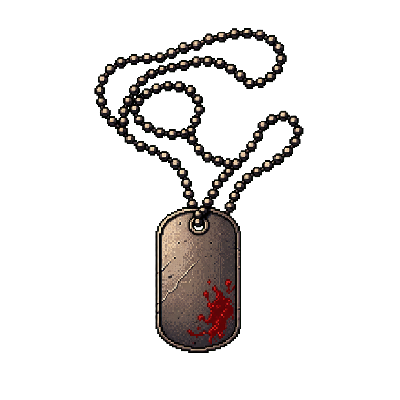

<div align="center">



# NEXUS.7

**Transmissions from the Digital Underground**

*An experiment in pixel-noir cyberpunk web design — built with AI.*

[**Live site →**](https://razee4315.github.io/NEXUS.7/)

</div>

---

## What's This?

NEXUS.7 is a fictional cyberpunk archive — visit it and you feel like you jacked into a forbidden terminal. Pixel art treated like cinema, scanlines, glitch decay, custom reticle cursor, parallax cityscape, pinned horizontal scroll. Mature pixel aesthetic — no cartoonish stuff.

Built as a stress-test of two AI tools working together.

## The Stack (the interesting part)

| Layer | Tool | Notes |
|---|---|---|
| **Image generation** | **ChatGPT Image 2.0** | Generated all 40 pixel-art assets — hero parallax layers, character portraits, cinematic story scenes, vault artifacts, UI bits |
| **Design + Implementation** | **Claude Opus 4.7** | Concept, art direction, full HTML/CSS/JS, GSAP scroll-jacking, Lenis smooth scroll, custom cursor, modal system, the lot |

**The result actually looks amazing.** Pixel-perfect parallax hero, bento grid of "case files," horizontal pinned scroll for the featured drop, click-to-open dossier modals on every transmission/operative/vault relic, terminal type-in animations, idle CRT flicker, footer skyline pan.

### Notes from the experiment

- **Image generation took some time** — 40 pixel-art assets at exact dimensions, with controlled palette and "not cartoonish" art direction, isn't fast. A couple needed re-rolls (the chromatic-aberration logo came out unreadable, so I used live HTML text instead).
- **Everything else was amazing.** Opus 4.7 took a vague brief ("pixel theme, not childish, amazing animations") and shipped: concept, color system, typography pairing, 8 distinct sections, parallax math, modal data architecture, accessibility (Esc, focus restore, reduced-motion), responsive breakpoints, and a custom cursor that uses `mix-blend-mode: difference` so it stays visible on any background.

## Sections

1. **Hero — JACK IN** — 4-layer parallax cityscape, pixel rain, glitch logo
2. **Manifesto** — terminal type-in reveal, hooded portrait, four-line creed
3. **Transmissions** — bento grid of 6 case files, click any to open dossier
4. **Featured Drop** — pinned horizontal scroll, 5 cinematic pixel scenes
5. **Operatives** — 4 character cards, click for full operative file
6. **Archive Vault** — 10 pixel artifacts, click any for evidence dossier
7. **Signal** — encrypted newsletter form
8. **Footer** — looping pixel skyline, live transmission log ticker

## Stack

- Vanilla HTML / CSS / JS — no build step
- [GSAP](https://gsap.com/) + ScrollTrigger for parallax + pinned horizontal scroll
- [Lenis](https://lenis.darkroom.engineering/) for smooth scroll
- Google Fonts: Press Start 2P, VT323, JetBrains Mono

## Run locally

```bash
git clone https://github.com/Razee4315/NEXUS.7.git
cd NEXUS.7
python -m http.server 5173
```

Open http://localhost:5173/.

## Credits

- Pixel art generated via ChatGPT Image 2.0
- Site design + implementation by Claude Opus 4.7
- Inspired by *Akira*, *Blade Runner*, *Kentucky Route Zero*

---

*All transmissions are fictional. Any resemblance to actual undergrounds, alive or buried, is coincidental.*
